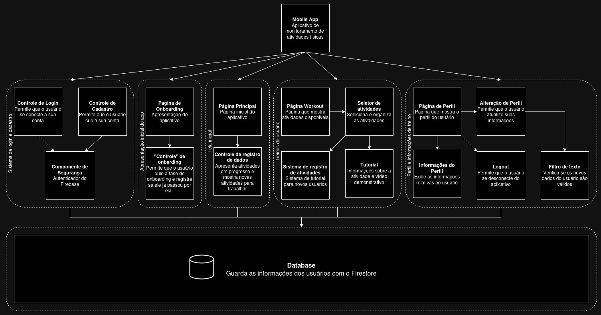

# mc656

## Membros

Guilherme Henrique Ferreira da Silva - 260469

Kairé Pereira Giovanetti - 260558

Lucca Chinelato - 239060

Ludivik de Paula - 235075

Pedro Antônio Félix Borges - 260628

## Diagrama de Componentes

## Descrição dos Componentes

### 1) Sistema de login e cadastro
- Gerencia o acesso do usuário ao aplicativo. Se comunica com o banco de dados para adicionar e autenticar o usuário.

    ### 1.1) Controle de login
    - É responsável pelo processo do usuário se conectar à sua conta. Validando seus dados através da comunicação com o banco de dados através do componente de segurança.

    ### 1.2) Controle de cadastro
    - Gerencia o processo de criação de conta do usuário, realizando a verificação dos seus dados, pela comunicação com o componente de segurança, e adicinando os dados ao banco de dados.

    ### 1.3) Componente de segurança
    - Realiza as verificações dos dados para o cadastro e para o login, adicionando-os ao banco de dados quando estão de acordo com os requisitos.

### 2) Apresentação inicial do app
- Tem a responsabilidade de apresentar aos novos usuários o funcionamento e as funcionalidades do aplicativo.
    ### 2.1) Página de onboarding
    - É responsável por apresentar ao usuário o funcionamento básico do aplicativo, e as funcionalidades oferecidas. Sua exibição é dependente do controle de onboarding.

    ### 2.2) Controle de onboarding
    - Tem a responsabilidade de controlar se o usuário irá ou não interagir com a página de onboarding, permitindo que ela seja pulada, ou que não seja mais vista caso já tenha passado pelo processo uma vez.

### 3) Tela inicial
- Mostra ao usuário uma visão geral das funcionalidades que podem ser realizadas no aplicativo. Se comunica com o banco de dados para acessar as atividades que estão sendo realizadas.
    ### 3.1) Página principal
    - Tem a função de agir como uma página central, permitindo que, a partir dela o usuário tenha acesso aos recursos disponíveis no aplicativo.

    ### 3.2) Controle de registro de dados
    - É responsável por registrar as atividades que estão sendo realizadas pelo usuário, e permite o início de novas atividades. Para isso, realiza a comunicação com o banco de dados.

### 4) Treinos de usuário
- Gerencia a realização de treinos por parte do usuário. Se comunicando com o banco de dados para ter acesso aos exercícios já realizados, e para a adição de novos exercícios.
    ### 4.1) Página workout
    - Tem a responsabilidade de permitir ao usuário o acesso às atividades que são realizadas e monitoradas pelo aplicativo. Faz comunicação com o banco de dados.

    ### 4.2) Seletor de atividades
    - É responsável por permitir ao usuário que seja realizada a seleção e a organização de atividades, que estão conectadas com o banco de dados.

    ### 4.3) Sistema de registro de atividades
    - Registra as atividades realizadas pelo usuário no banco de dados, permitindo que elas sejam vistas posteriormente.

    ### 4.4) Tutorial
    - Oferece informações sobre uma atividade, permitindo que o usuário aprenda a realizá-la através de um vídeo instrutivo, ou instruções detalhadas.

### 5) Perfil e informações de treino
- Gerencia os dados do usuário guardados no banco de dados. Permite a visualização e alteração desses dados.
    ### 5.1) Página de perfil
    - Mostra ao usuário o seu perfil do aplicativo. Para isso, é feita comunicação com o banco de dados.

    ### 5.2) Alteração de perfil
    - Permite que o usuário altere seus dados no aplicativo. Os novos dados passam pelo filtro de texto, e se estiverem de acordo com os requisitos, são enviados para o banco de dados.

    ### 5.3) Filtro de texto
    - Faz a verificação dos dados modificados, para garantir, antes da mudança ser realizada, que eles estão seguindo os seus determinados requisitos. Após a verificação os dados, se estiverem corretos, são comunicados para o banco de dadso.

    ### 5.4) Informações de perfil
    - Mostra ao usuário seus dados pessoais salvos no banco de dados do aplicativo.

    ### 5.5) Logout
    - Permite ao usuário sair do aplicativo naquele dispositivo.
    
### 6) Banco de dados
- Tem a responsabilidade de armazenar os dados pessoais e de treino do usuário.

## Estilo Arquitetural
O estilo arquitetural adotado principal foi o Model-View-Controller (MVC), caracterizado pela divisão em três camadas, a de exibição, a de implementação das funcionalidades, e a de controle entre elas. Esse modelo foi escolhido por permitir uma organização mais clara das funcionalidades, fazendo com que cada componente tivesse um conjunto mais focado em uma determinada área.

