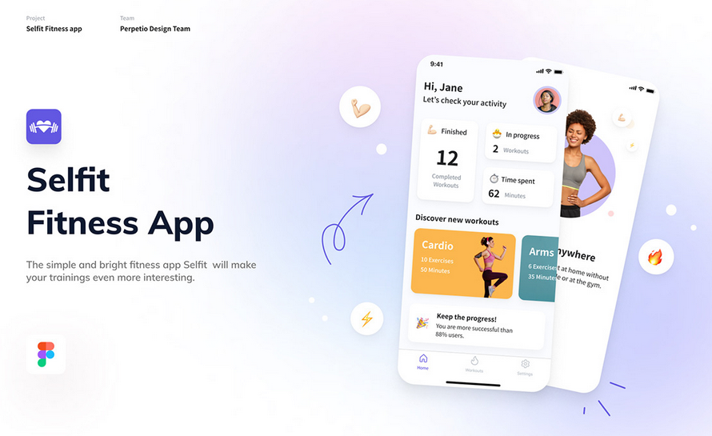
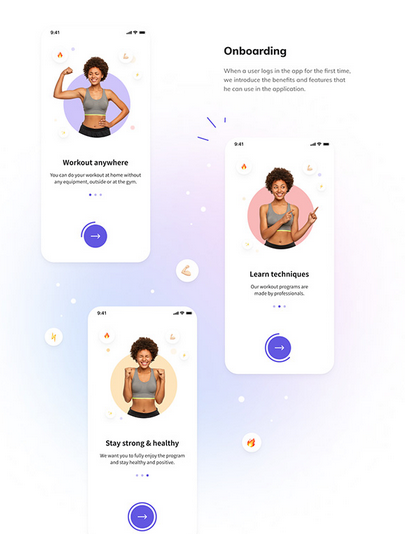
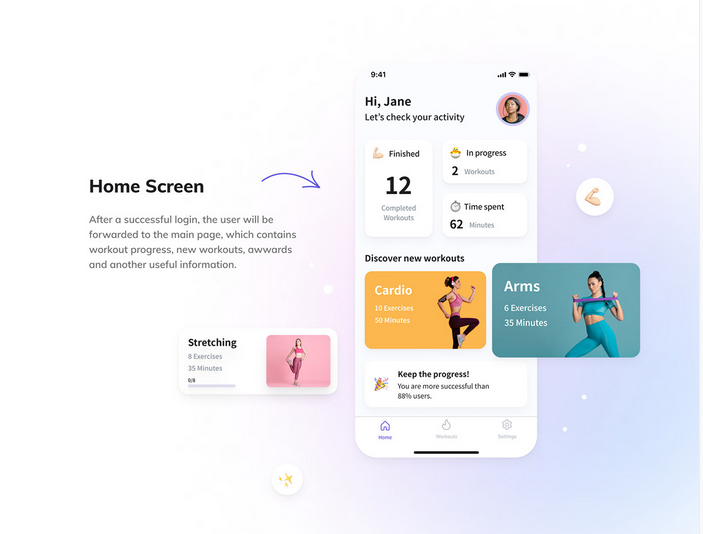
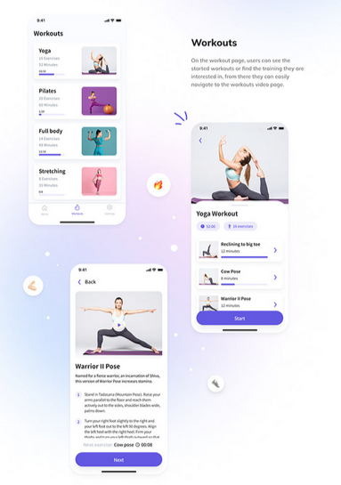
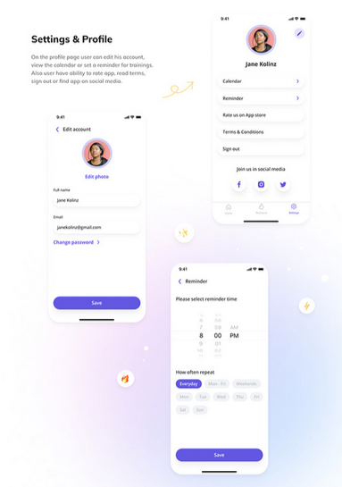

# Features a serem desenvolvidas no projeto

1. Cadastro de usuários
2. Cadastro de produtos
3. Cadastro de categorias

# Registro da execução da técnica de elicitação de requisitos
## Técnica escolhida: BENCHMARKING

### [Selfit Fitness App](https://play.google.com/store/apps/details?id=com.yazio.android&hl=en&pli=1)

Este é um projeto open-source em Flutter que inclui vídeos e tutoriais sobre a aplicação, com foco em treinos rápidos e práticos.

#### Documentação de Features e Funcionalidades
Nesta etapa, analisamos o design e as funcionalidades gerais do produto, destacando suas principais ideias.

As features mais interessantes são:

- Onboarding 

A introdução do aplicativo, que orienta o usuário na primeira utilização, explica os principais benefícios e funcionalidades do app.

- Tela principal

A tela inicial possui um design claro e funcional, que inclui um hub de motivação. Nela, o usuário encontra dados sobre treinos completados, em andamento e o tempo total exercitado. Além disso, há uma lista de novos treinos sugeridos.

- Workouts

Esta é a funcionalidade principal do aplicativo, onde o usuário pode visualizar treinos concluídos e em andamento, bem como explorar novos treinos. Cada exercício conta com vídeos explicativos para orientar o usuário.

- Perfil e Configurações
  

Uma função básica que permite ao usuário atualizar informações de perfil, como foto e nome.

- Reminder

Uma função de lembrete que envia notificações no horário selecionado pelo usuário para lembrar dos treinos.

#### Pontos positivos e negativos

- Positivos
  - Projeto open-source que serve como base sólida para o desenvolvimento do nosso app.
  - Design claro e objetivo.
  - Onboarding eficaz para introduzir o app ao usuário.
  - Função de lembrete para organização e motivação do usuário.
  - Treinos rápidos e objetivos.
  - Vídeos explicativos para todos os exercícios.
  
- Negativos
  - Não foi possível executar a aplicação, então a análise ficou restrita ao design.
  
Em resumo, o projeto é uma base valiosa para nosso app, que será personalizado e expandido com novas funcionalidades.

 

### Pontos de atenção encontrados

## Técnica escolhida: Entrevista com uso de cenários

Durante a elicitção de requisitos foram identificados...

### Pontos de atenção encontrados