# Features a serem desenvolvidas no projeto

Epic 1: Onboarding e Tutorial do App

- User Story 1.1: Tutorial para novos usuários
  - “Como novo usuário, quero ser guiado por um tutorial para entender as principais funcionalidades do app, para usá-lo de maneira eficiente.”

- User Story 1.2: Opção de pular o tutorial
  - “Como usuário, quero a opção de pular o tutorial caso já conheça o app, para economizar tempo.”

Epic 2: Treinos

- User Story 2.1: Visualizar treinos em progresso
  - "Como usuário, quero visualizar meus treinos em progresso, para acompanhar meu desenvolvimento."
 
- User Story 2.2: Procurar novos treinos
  - "Como usuário, quero poder procurar novos treinos para diversificar minha rotina de exercícios."
 
- User Story 2.3: Acessar vídeos dos treinos
  - “Como usuário, quero acessar vídeos dos treinos a partir da página de treinos, para realizar os exercícios corretamente.”
 
Epic 3: Perfil e Configurações

- User Story 3.1: Editar perfil
  - "Como usuário, quero editar minha foto, email, nome e senha para manter minhas informações pessoais atualizadas."

- User Story 3.2: Visualizar calendário de treino e descanso
  - "Como usuário, quero visualizar um calendário com meus dias de treino e descanso, para planejar minha rotina de exercícios."

- User Story 3.3: Receber lembretes para a hora do treino
  - "Como usuário, quero receber lembretes para a hora do treino, para não perder minha rotina."

- User Story 3.4: Links para avaliação do app e redes sociais
  - "Como usuário, quero acessar links para avaliar o app e seguir suas redes sociais, para apoiar e interagir com a comunidade do app."

- User Story 3.5: Logout
  - "Como usuário, quero poder sair da minha conta, para garantir a privacidade dos meus dados."

User Story 3.6: Termos e condições
  - "Como usuário, quero poder ler os termos e condições do app, para entender melhor meus direitos e responsabilidades."

# Registro da execução da técnica de elicitação de requisitos
## Técnica escolhida: BENCHMARKING

### [Selfit Fitness App](https://play.google.com/store/apps/details?id=com.yazio.android&hl=en&pli=1)

Este é um projeto open-source em Flutter que inclui vídeos e tutoriais sobre a aplicação, com foco em treinos rápidos e práticos.

#### Documentação de Features e Funcionalidades
Nesta etapa, analisamos o design e as funcionalidades gerais do produto, destacando suas principais ideias.

As features mais interessantes são:

- Onboarding 

A introdução do aplicativo, que orienta o usuário na primeira utilização, explica os principais benefícios e funcionalidades do app.

- Tela principal

A tela inicial possui um design claro e funcional, que inclui um hub de motivação. Nela, o usuário encontra dados sobre treinos completados, em andamento e o tempo total exercitado. Além disso, há uma lista de novos treinos sugeridos.

- Workouts

Esta é a funcionalidade principal do aplicativo, onde o usuário pode visualizar treinos concluídos e em andamento, bem como explorar novos treinos. Cada exercício conta com vídeos explicativos para orientar o usuário.

- Perfil e Configurações
  

Uma função básica que permite ao usuário atualizar informações de perfil, como foto e nome.

- Reminder

Uma função de lembrete que envia notificações no horário selecionado pelo usuário para lembrar dos treinos.

#### Pontos positivos e negativos

- Positivos
  - Projeto open-source que serve como base sólida para o desenvolvimento do nosso app.
  - Design claro e objetivo.
  - Onboarding eficaz para introduzir o app ao usuário.
  - Função de lembrete para organização e motivação do usuário.
  - Treinos rápidos e objetivos.
  - Vídeos explicativos para todos os exercícios.
  
- Negativos
  - Não foi possível executar a aplicação, então a análise ficou restrita ao design.
  
Em resumo, o projeto é uma base valiosa para nosso app, que será personalizado e expandido com novas funcionalidades.

 
### [Yazio App](https://www.yazio.com/pt)

Aplicativo de acompanhamento nutricional

#### Documentação de Features e Funcionalidades
- Anamnese nutricional

  
  

  Um formulário para coletar dados sobre o usuário, que permite ao aplicativo sugerir a quantidade ideal de calorias e macronutrientes para o perfil de cada pessoa.

- Contador de macros e calorias

  
  

  O usuário pode registrar alimentos e refeições nas categorias de café da manhã, almoço, jantar e lanches. O app calcula e exibe os macros e calorias tanto de cada refeição quanto do total diário.

- Review das refeições

  

  Sempre que o usuário insere uma refeição, o app destaca as principais características nutricionais dos alimentos, como ser alto em calorias, gordura, ou baixo em calorias, entre outros.

- Sistema de Streaks

  O aplicativo incentiva o usuário a registrar suas refeições diariamente por meio de um sistema de streaks, motivando a constância.

- Reaproveitamento de alimentos e refeições

  
  

  O usuário pode duplicar uma refeição para outros dias, sem precisar adicionar alimentos individualmente novamente. Além disso, alimentos recentemente usados ficam acessíveis em um menu rápido para seleção.

- Integração com apps de tracking de atividade física

  

  Com a integração, o app mostra as calorias gastas em atividades físicas e ajusta a meta diária de calorias a serem consumidas.

- Tracker de medidas e ingestão de água
  
  

  O aplicativo permite registrar medidas e peso corporal (Olhar na imagem anterior) e inclui um tracker para ingestão de água, com notificações para lembrar o usuário de se hidratar ao longo do dia.

#### Pontos positivos e negativos

- Positivos
  - Recomendações personalizadas e ajustadas via anamnese.
  - Gamificação que estimula o usuário a manter a consistência.
  - Metas e objetivos adaptáveis às necessidades do usuário.
  - Facilidade de inserir refeições e alimentos ao plano alimentar.
  - Avaliação detalhada das refeições registradas.

- Negativos
  - Excesso de propagandas.
  - Perguntas redundantes na anamnese.
  - Muitas funcionalidades agrupadas na página principal, o que pode confundir novos usuários.
  - Processo trabalhoso para adicionar uma refeição/alimento pela primeira vez.
  

### [Samsung Health](https://www.samsung.com/br/apps/samsung-health/)

Aplicativo para acompanhamento de atividades físicas e hábitos diários

#### Documentação de Features e Funcionalidades

- Progresso do usuário
  
  
  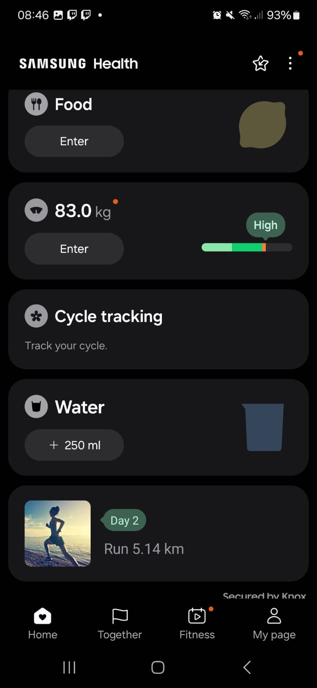

  O usuário pode disponibilizar suas informações, tais como peso, horas de sono e alimentos ingeridos, para acompanhar seu progresso e bem-estar. 
  Também é disponibilizado o seu progresso em calorias perdidas, passos dados, horas de sono e tempo gasto em atividades.
  

- Foco e exercícios favoritos
  
  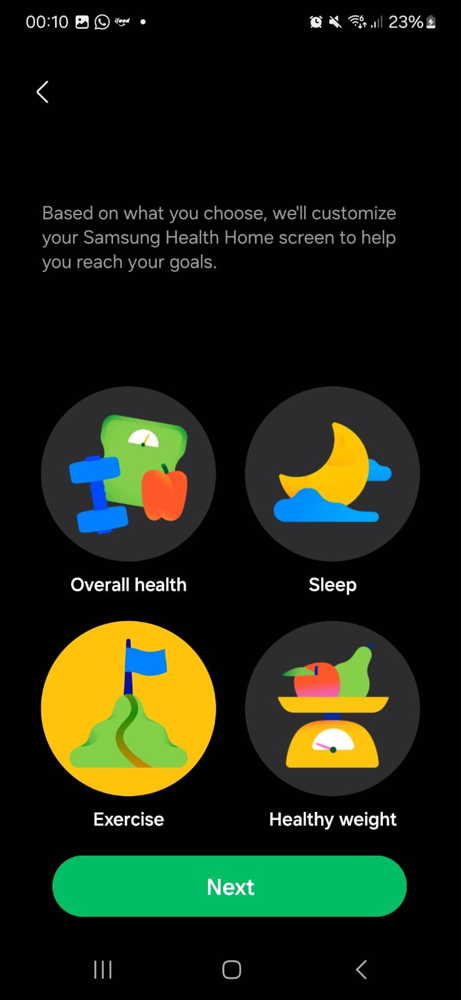
  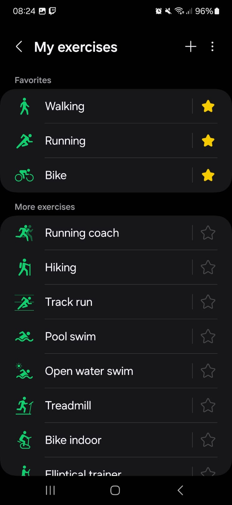

  Usuário pode escolher qual seu foco principal com o uso do aplicativo (Exercícios, Sono, Peso ou Saúde em geral). Além disso, pode favoritar os tipos de exercício de maior interesse.

- Perfil do usuário
  
  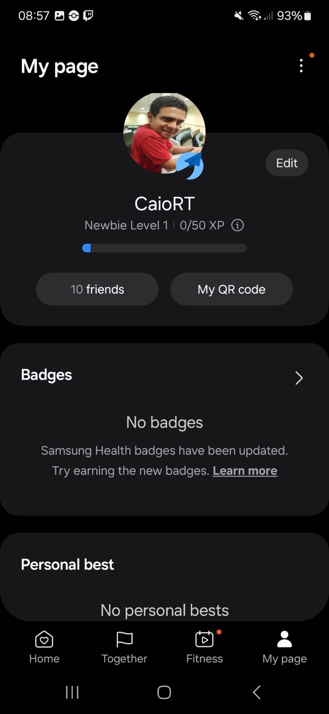
  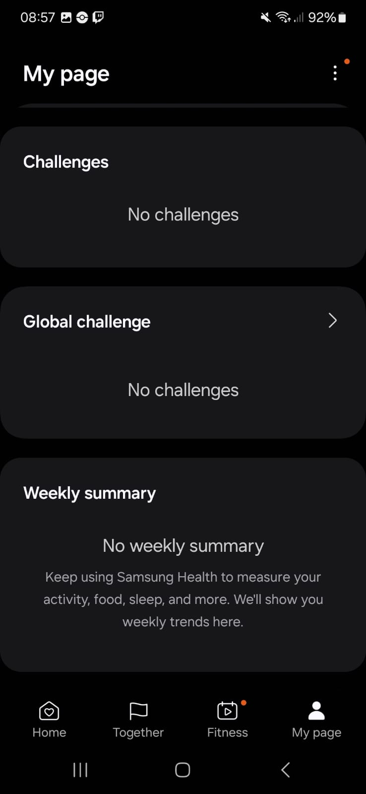

  Perfil apresenta um sístema de níveis e títulos de progresso. Usuário pode acompanhar seu reseumo semanal, badges conquistadas e desafios dos quais faz parte.

  Há também um QR code disponível para compartilhamento do perfil, além das amizades já feitas.
  

- "Fitness" - Exercícios e atividades disponíveis

  
  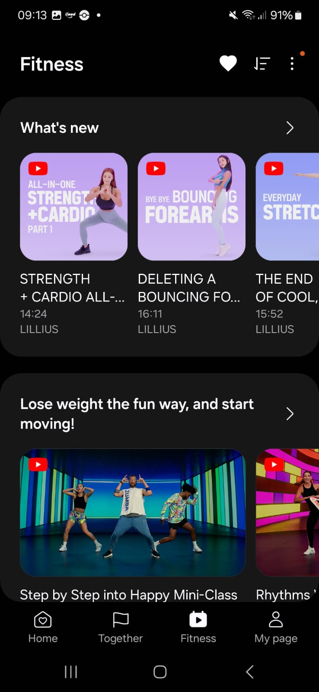
  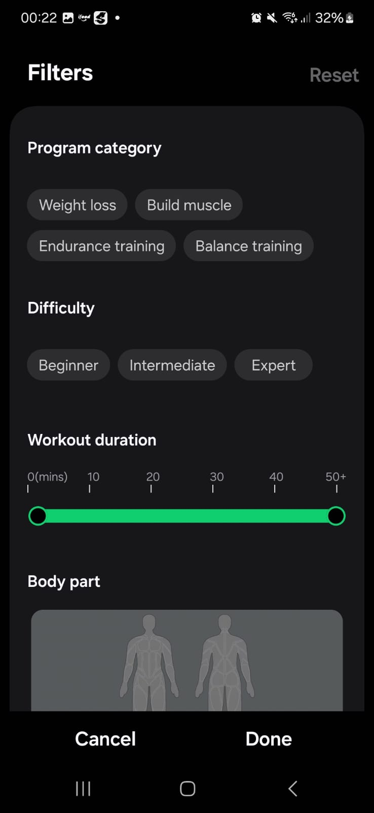

  Representa um conjunto de programas disponíveis ao usuário, compostos por vídeos e rotinas.
  Para cada conteúdo, separados por categoria, há um nível de dificuldade, e o app calcula o tempo de duração.
  O usuário pode adicionar o programa ao seu perfil, onde ficam registrados os exercícios completos, incompletos e perdidos.
  
  Há um sistema de filtros, divididos em categoria, dificuldade, duração, parte do corpo e necessidade de equipamentos.
  
  
- "Together" - Rankings e desafios
  
   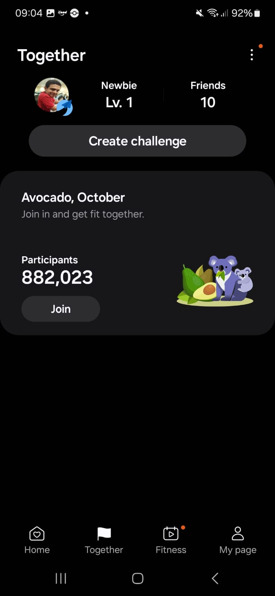
   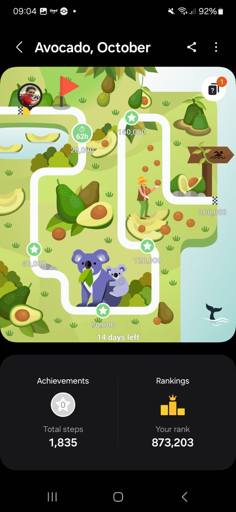

   Permite compartilhar exercícios e desafios com amigos e outras pessoas. Há um sistema de rankings por desafio e um sistema de visualização de progresso.

#### Pontos positivos e negativos

- Positivos
  - Na aba Fitness, há uma variedade muito grande de programas, contendo rotinas de corrida, ciclismo, dança e até exercícios de respiração.
  - Ainda na aba Fitness, há conteúdos que são disponibilizados por outros serviços, e não pelo próprio app. Isso possibilita um maior número de abordagens e métodos para exercícios.
  - O sistema de rotinas permite que o usuário se organize de acordo com suas agendas e programas.
  - A determinação de metas e o sistema de níveis estimulam o usuário a continuar se exercitando.
  - Os desafios de bater as próprias marcas pessoais estimulam o usuário a ultrapassar seus limites.
  - Ao possibilitar que o usuário escolha o seu foco, permite-se um desenvolvimento mais eficiente.
  - Visualização de progresso possibilita um melhor acompanhamento do usuário e permite que ele avalie o que pode ser melhorado.
  

- Negativos
  - O sistema de níveis é bem interessante,  mas as recompensas por avançar de nível não são muito claras.
  - Seria útil se fosse possível pesquisar o perfil de outros usuários.
  - Apesar de ter um ótimo sistema de filtros, não é possível pesquisar programas e atividade por nome na aba "Fitness".

  
### [STRAVA](https://www.strava.com/?hl=pt-BR)

Aplicativo de registro e acompanhamento de exercícios físicos.

### Documentação de Features e Funcionalidades

- Acompanhamento do progresso nas atividades

  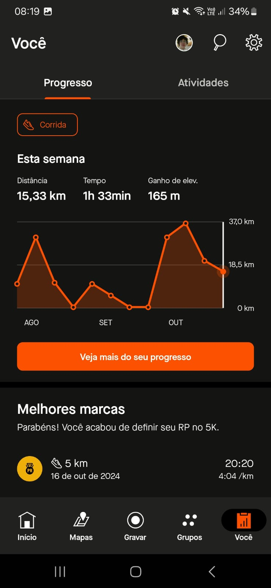
  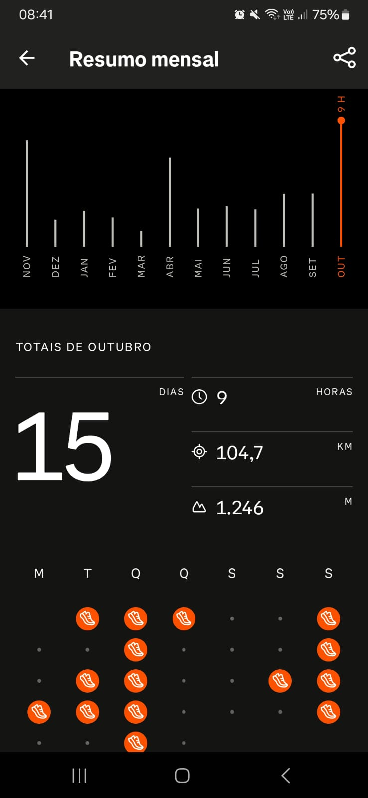

  Permite ao usuário acompanhar o número de atividades, dias, quilômetros, ou outras medidas de exercícios físicos realizados ao longo de um certo período de tempo, e em comparação com períodos anteriores.

- Interação com outros usuários
  
  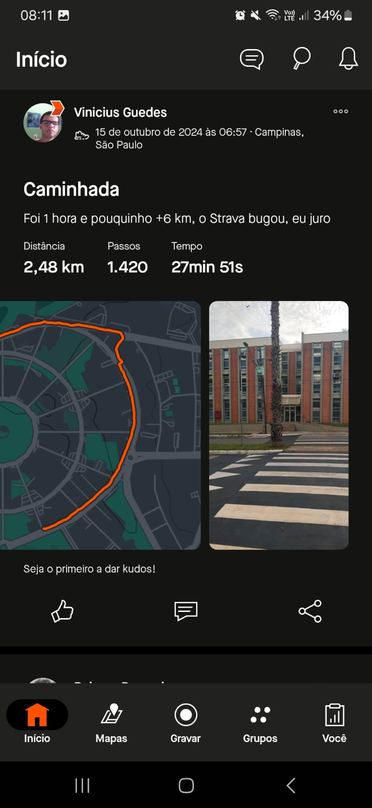
  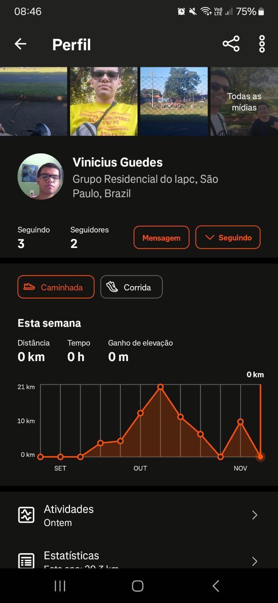
  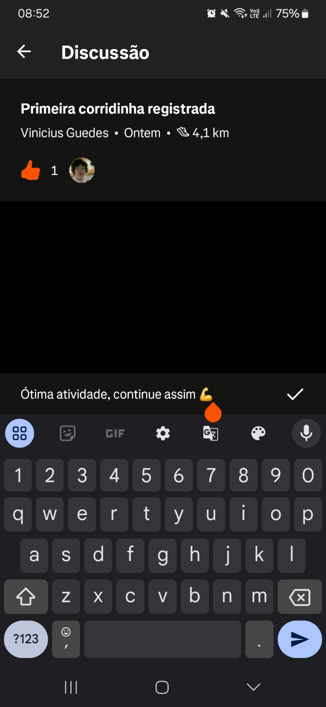

  As atividades das pessoas seguidas por um usuário são exibidas na tela inicial, e é possível acessar os perfis para acompanhar também seu progresso. Ademais, o aplicativo permite interações básicas com essas atividades, como a realização de comentários, e "dar kudos", a versão do aplicativo de um "like".

- Medalhas e "Stickers" de incentivo
  
  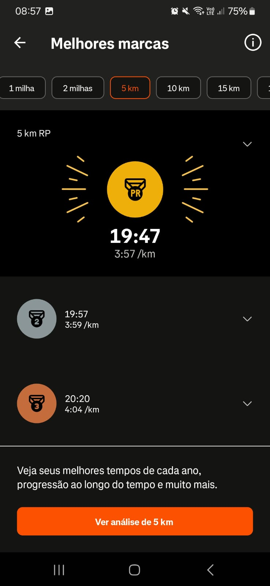
  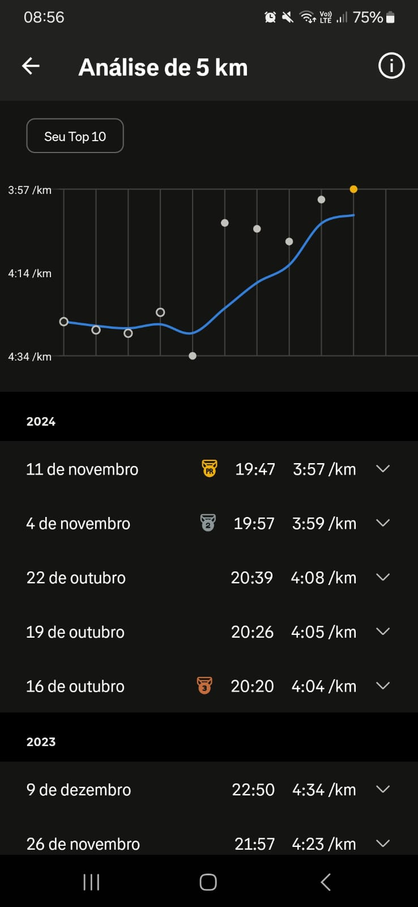
  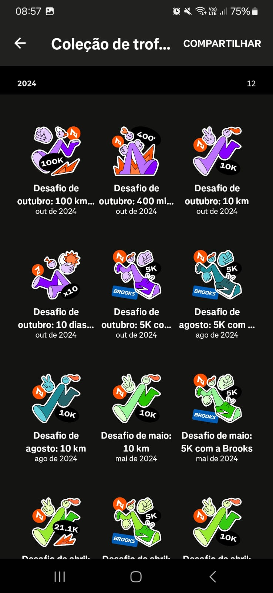

  Ao realizar uma atividade, é possível receber medalhas, de ouro, prata, ou bronze, com base em como ela se compara às suas atividades realizadas anteriormente. É possível participar, também, de desafios específicos, para cumprir certas metas, sendo recompensado com "Stickers" no aplicativo.

- Grupos de pessoas que praticam atividades

  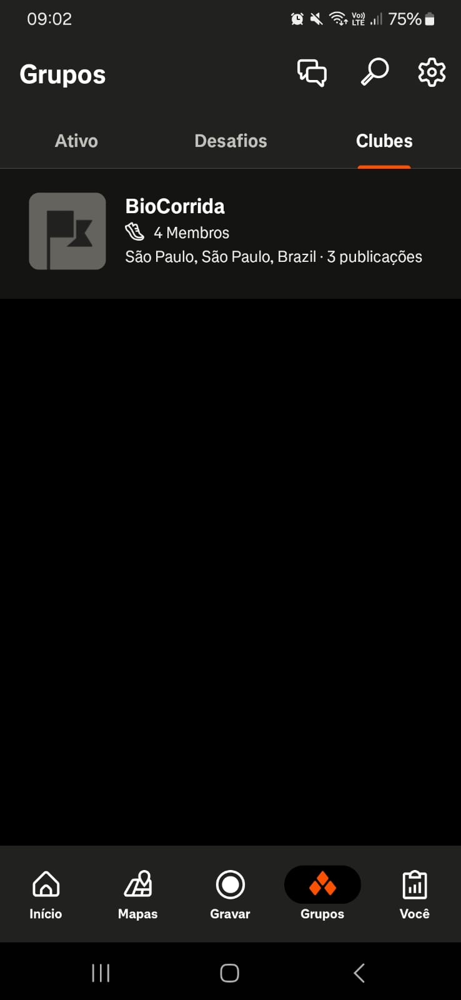
  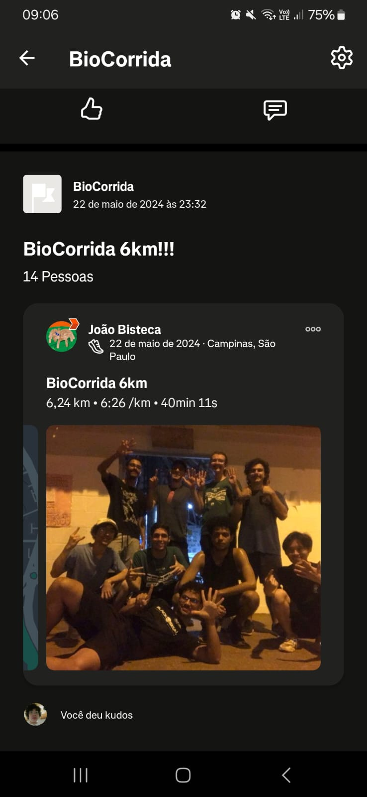

  O aplicativo permite a participação de grupos de realização de atividades, nos quais pode-se registrar os exercícios realizados em conjunto, além de acompanhar estatísticas do grupo, postar fotos, e interagir com os outros membros.

- Integração com outros aplicativos

  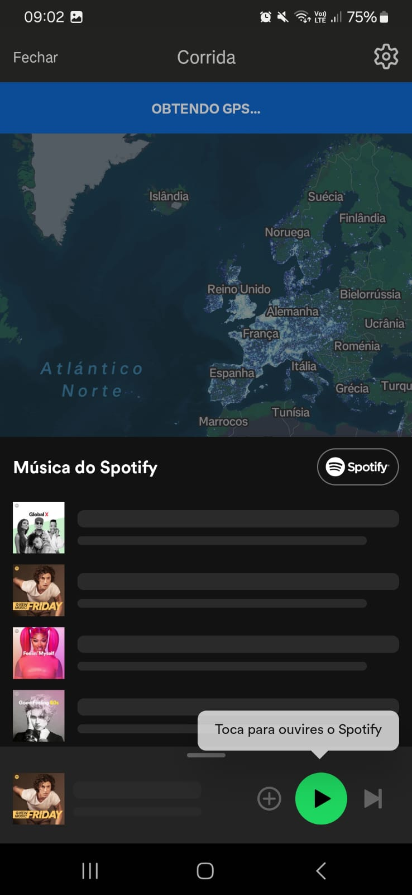
  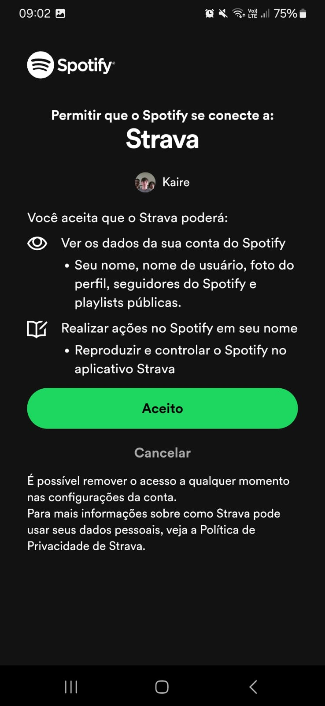

  É possível integrar outros aplicativos ao Strava, permitindo escutar músicas, migrar seus dados de outros aplicativos utilizados anteriormente, e postar suas atividades nas redes sociais.

#### Pontos positivos e negativos

- Positivos
  - Fácil de iniciar a realização de uma atividade, diminuindo possíveis distrações e “desculpas”.
  - O acompanhamento do progresso, em conjunto com as medalhas, são uma fonte de motivação efetiva.
  - O “kudos” e os comentários servem como uma maneira simples e divertida de interagir, incentivando o uso frequente do aplicativo, e, consequentemente, a prática frequente de atividades físicas.

- Negativos
  - Certas funções de acompanhamento de progresso estão barradas por uma inscrição paga.
  - Apesar de ser um aplicativo para atividades físicas em geral, há bem mais funções para corrida e pedalada se comparado a outras atividades.
  - Navegação confusa entre a aba “Você” e o perfil do usuário, nem sempre fica claro o que está onde.
  - O sistema de “Stickers” é rígido, não permitindo a definição de metas pessoais, e desafios menores ou maiores do que os já estabelecidos pelo aplicativo.

## Técnica escolhida: Entrevista com uso de cenários

Durante a elicitção de requisitos foram identificados...

### Pontos de atenção encontrados
