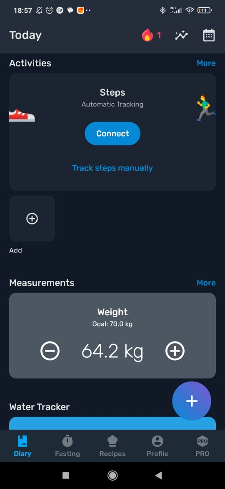
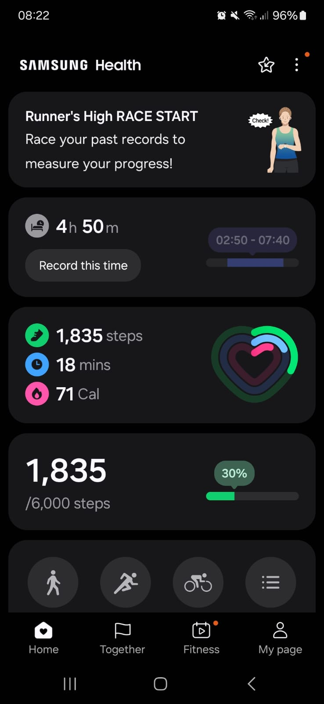
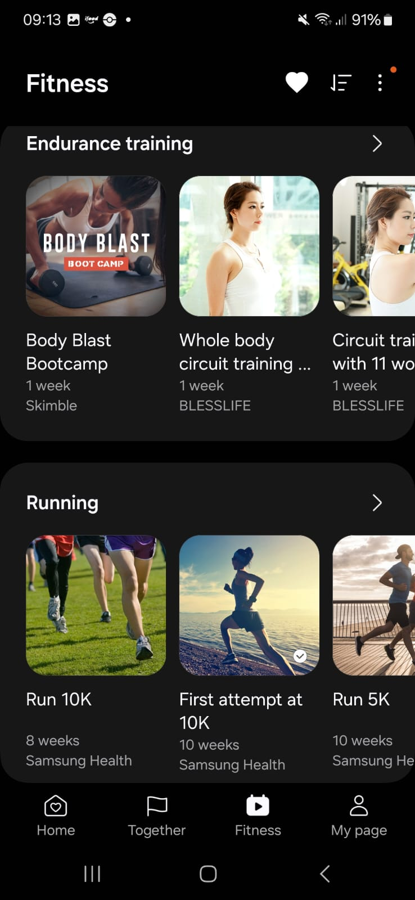

# Features a serem desenvolvidas no projeto

1. Cadastro de usuários
2. Cadastro de produtos
3. Cadastro de categorias

# Registro da execução da técnica de elicitação de requisitos
## Técnica escolhida: BENCHMARKING

### [Selfit Fitness App](https://play.google.com/store/apps/details?id=com.yazio.android&hl=en&pli=1)

Este é um projeto open-source em Flutter que inclui vídeos e tutoriais sobre a aplicação, com foco em treinos rápidos e práticos.

#### Documentação de Features e Funcionalidades
Nesta etapa, analisamos o design e as funcionalidades gerais do produto, destacando suas principais ideias.

As features mais interessantes são:

- Onboarding 

A introdução do aplicativo, que orienta o usuário na primeira utilização, explica os principais benefícios e funcionalidades do app.

- Tela principal

A tela inicial possui um design claro e funcional, que inclui um hub de motivação. Nela, o usuário encontra dados sobre treinos completados, em andamento e o tempo total exercitado. Além disso, há uma lista de novos treinos sugeridos.

- Workouts

Esta é a funcionalidade principal do aplicativo, onde o usuário pode visualizar treinos concluídos e em andamento, bem como explorar novos treinos. Cada exercício conta com vídeos explicativos para orientar o usuário.

- Perfil e Configurações
  

Uma função básica que permite ao usuário atualizar informações de perfil, como foto e nome.

- Reminder

Uma função de lembrete que envia notificações no horário selecionado pelo usuário para lembrar dos treinos.

#### Pontos positivos e negativos

- Positivos
  - Projeto open-source que serve como base sólida para o desenvolvimento do nosso app.
  - Design claro e objetivo.
  - Onboarding eficaz para introduzir o app ao usuário.
  - Função de lembrete para organização e motivação do usuário.
  - Treinos rápidos e objetivos.
  - Vídeos explicativos para todos os exercícios.
  
- Negativos
  - Não foi possível executar a aplicação, então a análise ficou restrita ao design.
  
Em resumo, o projeto é uma base valiosa para nosso app, que será personalizado e expandido com novas funcionalidades.

 
### [Yazio App](https://www.yazio.com/pt)

Aplicativo de acompanhamento nutricional

#### Documentação de Features e Funcionalidades
- Anamnese nutricional

  
  

  Um formulário para coletar dados sobre o usuário, que permite ao aplicativo sugerir a quantidade ideal de calorias e macronutrientes para o perfil de cada pessoa.

- Contador de macros e calorias

  
  

  O usuário pode registrar alimentos e refeições nas categorias de café da manhã, almoço, jantar e lanches. O app calcula e exibe os macros e calorias tanto de cada refeição quanto do total diário.

- Review das refeições

  

  Sempre que o usuário insere uma refeição, o app destaca as principais características nutricionais dos alimentos, como ser alto em calorias, gordura, ou baixo em calorias, entre outros.

- Sistema de Streaks

  O aplicativo incentiva o usuário a registrar suas refeições diariamente por meio de um sistema de streaks, motivando a constância.

- Reaproveitamento de alimentos e refeições

  
  

  O usuário pode duplicar uma refeição para outros dias, sem precisar adicionar alimentos individualmente novamente. Além disso, alimentos recentemente usados ficam acessíveis em um menu rápido para seleção.

- Integração com apps de tracking de atividade física

  

  Com a integração, o app mostra as calorias gastas em atividades físicas e ajusta a meta diária de calorias a serem consumidas.

- Tracker de medidas e ingestão de água
  
  

  O aplicativo permite registrar medidas e peso corporal (Olhar na imagem anterior) e inclui um tracker para ingestão de água, com notificações para lembrar o usuário de se hidratar ao longo do dia.

#### Pontos positivos e negativos

- Positivos
  - Recomendações personalizadas e ajustadas via anamnese.
  - Gamificação que estimula o usuário a manter a consistência.
  - Metas e objetivos adaptáveis às necessidades do usuário.
  - Facilidade de inserir refeições e alimentos ao plano alimentar.
  - Avaliação detalhada das refeições registradas.

- Negativos
  - Excesso de propagandas.
  - Perguntas redundantes na anamnese.
  - Muitas funcionalidades agrupadas na página principal, o que pode confundir novos usuários.
  - Processo trabalhoso para adicionar uma refeição/alimento pela primeira vez.
  

### Pontos de atenção encontrados

### [Samsung Health](https://www.samsung.com/br/apps/samsung-health/)

Aplicativo para acompanhamento de atividades físicas e hábitos diários

#### Documentação de Features e Funcionalidades

- Progresso do usuário
  
  
  

  O usuário pode disponibilizar suas informações, tais como peso, horas de sono e alimentos ingeridos, para acompanhar seu progresso e bem-estar. 
  Também é disponibilizado o seu progresso em calorias perdidas, passos dados, horas de sono e tempo gasto em atividades.
  

- Foco e exercícios favoritos
  
  
  

  Usuário pode escolher qual seu foco principal com o uso do aplicativo (Exercícios, Sono, Peso ou Saúde em geral). Além disso, pode favoritar os tipos de exercício de maior interesse.

- Perfil do usuário
  
  
  

  Perfil apresenta um sístema de níveis e títulos de progresso. Usuário pode acompanhar seu reseumo semanal, badges conquistadas e desafios dos quais faz parte.

  Há também um QR code disponível para compartilhamento do perfil, além das amizades já feitas.
  

- "Fitness" - Exercícios e atividades disponíveis

  
  
  

  Representa um conjunto de programas disponíveis ao usuário, compostos por vídeos e rotinas.
  Para cada conteúdo, separados por categoria, há um nível de dificuldade, e o app calcula o tempo de duração.
  O usuário pode adicionar o programa ao seu perfil, onde ficam registrados os exercícios completos, incompletos e perdidos.
  
  Há um sistema de filtros, divididos em categoria, dificuldade, duração, parte do corpo e necessidade de equipamentos.
  
  
- "Together" - Rankings e desafios
  
   
   

   Permite compartilhar exercícios e desafios com amigos e outras pessoas. Há um sistema de rankings por desafio e um sistema de visualização de progresso.

#### Pontos positivos e negativos

- Positivos
  - Na aba Fitness, há uma variedade muito grande de programas, contendo rotinas de corrida, ciclismo, dança e até exercícios de respiração.
  - Ainda na aba Fitness, há conteúdos que são disponibilizados por outros serviços, e não pelo próprio app. Isso possibilita um maior número de abordagens e métodos para exercícios.
  - O sistema de rotinas permite que o usuário se organize de acordo com suas agendas e programas.
  - A determinação de metas e o sistema de níveis estimulam o usuário a continuar se exercitando.
  - Os desafios de bater as próprias marcas pessoais estimulam o usuário a ultrapassar seus limites.
  - Ao possibilitar que o usuário escolha o seu foco, permite-se um desenvolvimento mais eficiente.
  - Visualização de progresso possibilita um melhor acompanhamento do usuário e permite que ele avalie o que pode ser melhorado.
  

- Negativos
  - O sistema de níveis é bem interessante,  mas as recompensas por avançar de nível não são muito claras.
  - Seria útil se fosse possível pesquisar o perfil de outros usuários.
  - Apesar de ter um ótimo sistema de filtros, não é possível pesquisar programas e atividade por nome na aba "Fitness".

  

## Técnica escolhida: Entrevista com uso de cenários

Durante a elicitção de requisitos foram identificados...

### Pontos de atenção encontrados
